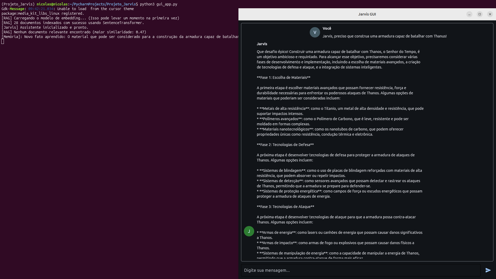
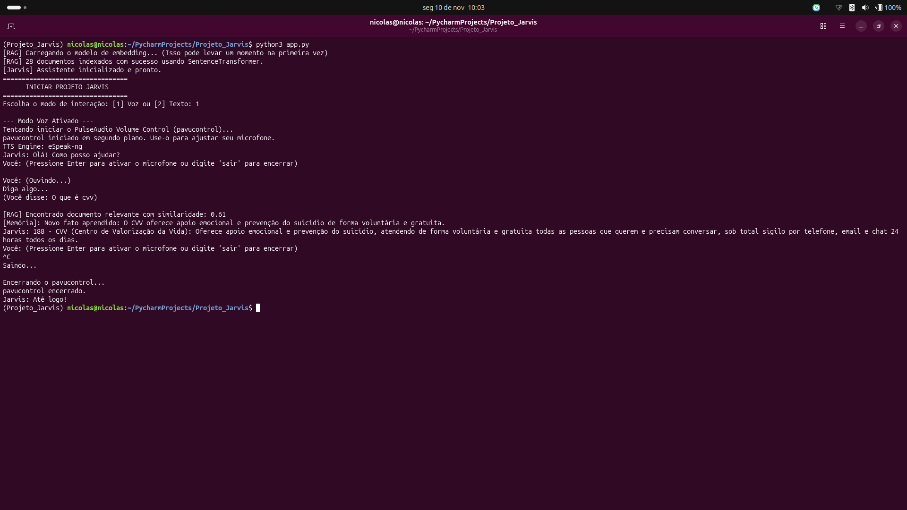
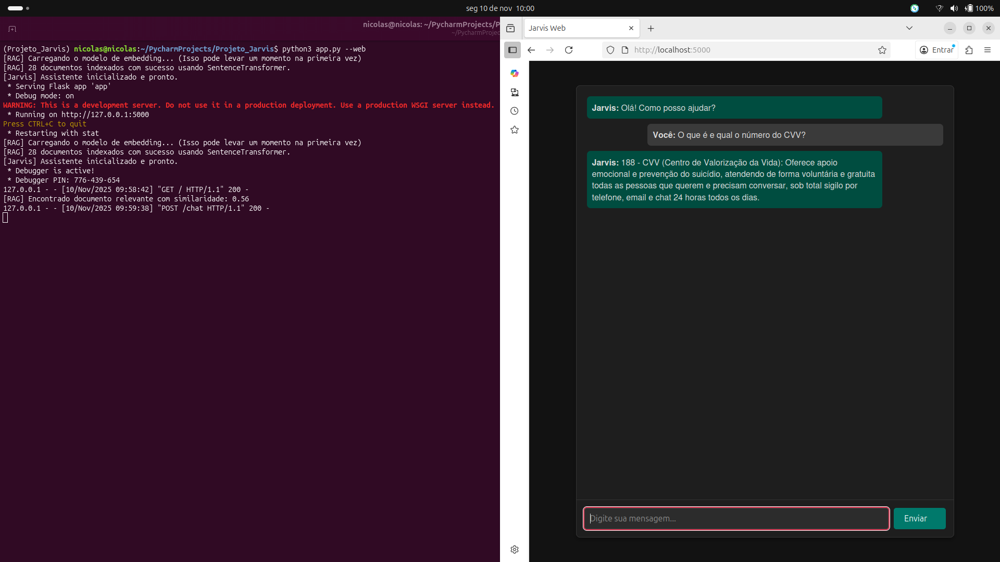

# Projeto Jarvis - Assistente de Linguagem Natural

Este projeto implementa um assistente de linguagem natural multifacetado, inspirado no Jarvis. Ele combina um poderoso modelo de linguagem (LLM) com uma base de conhecimento local, memória de longo prazo e múltiplas interfaces de usuário, incluindo CLI, Web e uma GUI de desktop.

## Funcionalidades Principais

- **Pesquisa na Web em Tempo Real:** O Jarvis agora pode decidir autonomamente quando uma pergunta requer informações atuais. Ele formula uma query de busca, pesquisa na web usando a API do DuckDuckGo e sintetiza os resultados para fornecer respostas atualizadas sobre notícias, eventos, previsão do tempo, etc.
- **Integração com LLM Moderno:** Utiliza a biblioteca `huggingface-hub` para uma integração robusta com modelos de ponta (atualmente `meta-llama/Meta-Llama-3-8B-Instruct`).
- **Análise de Sentimentos:** O Jarvis detecta o sentimento (positivo, negativo, neutro) do usuário em cada interação e usa esse contexto para adaptar o tom de suas respostas.
- **RAG com Busca Semântica:** Usa `sentence-transformers` para uma busca por significado nos seus documentos locais (`knowledge/`), garantindo respostas precisas e contextuais.
- **Memória de Longo Prazo:** O Jarvis aprende com suas conversas, extraindo e armazenando fatos importantes em `memory/memory.json` para personalizar interações futuras.
- **Múltiplas Interfaces:**
  - **GUI de Desktop:** Uma interface gráfica moderna e bonita construída com **Flet**.
  - **CLI (Voz e Texto):** Um assistente de voz completo no terminal, com ativação de microfone sob demanda e uma opção de modo texto.
  - **Web:** Uma interface de chat simples e reativa, construída com Flask e HTMX.
- **Configuração Automática de Microfone (Linux):** Tenta desmutar e ajustar o volume do microfone padrão ao iniciar o modo de voz.
- **Opções de Voz (TTS):** Suporte para as vozes nativas do sistema (`pyttsx3`) e para o motor offline `eSpeak-ng`.
- **Segurança:** Inclui um "modo seguro" para comandos sensíveis e um `.gitignore` robusto para prevenir o vazamento de segredos.
- **Suíte de Testes:** Acompanha testes unitários (`pytest`) para garantir a estabilidade e a funcionalidade.

---


## Conhecimento

---
1. [Guia de Estudo e Recursos do Projeto Jarvis](documents/LEARNING_RESOURCES.md)
2. [Prompt Templates para o Jarvis](documents/prompt_templates.md)
3. [A Arquitetura de Memória Dupla do Projeto Jarvis](documents/MEMORY_ARCHITECTURE.md)
4. [Documentação Técnica do Projeto Jarvis](documents/documents.md)


## Telas do projeto

---


_Images 1: Jarvis GUI_


_Images 2: Jarvis CLI_


_Images 3: Jarvis Web_

---


## Estrutura do Projeto

```
Projeto_Jarvis/
├── .env.example              # Exemplo de arquivo de configuração de ambiente
├── .gitignore                # Arquivos e pastas a serem ignorados pelo Git
├── README.md                 # Este arquivo
├── app.py                    # Ponto de entrada para as interfaces CLI e Web (Flask)
├── check_mics.py             # Script para listar microfones disponíveis (Linux)
├── commands.py               # Módulo para lidar com comandos específicos
├── environment.yml           # Arquivo de ambiente para Conda
├── examples/                 # Scripts de exemplo para demonstrar funcionalidades
│   ├── demo_api_client.py    # Exemplo de como interagir com a API web do Jarvis
│   ├── demo_cli_programmatic.py # Exemplo de como usar a classe Jarvis diretamente
│   └── demo_rag.py           # Exemplo de como o RAG funciona
├── gui_app.py                # Ponto de entrada para a Interface Gráfica (Flet)
├── iniciar_jarvis.bat        # Script de inicialização para Windows (ativa Conda e oferece menu)
├── jarvis.py                 # Lógica central do assistente (orquestra NLP, RAG, Memória, Comandos)
├── knowledge/                # Pasta para a base de conhecimento estático (RAG)
│   ├── marvel_data.md        # Exemplo de documento sobre heróis/vilões da Marvel
│   └── servicos_publicos_br.md # Exemplo de documento sobre serviços públicos brasileiros
│   ├── ... (seus arquivos .md ou .txt)
├── memory/                   # Pasta para a memória de longo prazo
│   └── memory.json           # Arquivo onde os fatos aprendidos são armazenados
├── minimal_mic_test.py       # Script para testes isolados do microfone (depuração)
├── nlp_client.py             # Cliente para interagir com a API do LLM (Hugging Face, Replicate)
├── prompt_templates.md       # Exemplos de prompts para o LLM
├── rag.py                    # Lógica do Retrieval-Augmented Generation (busca semântica)
├── requirements.txt          # Lista de dependências para pip
├── sentiment.py              # Módulo de Análise de Sentimentos
├── stt.py                    # Módulo de Speech-to-Text (converte fala em texto)
├── templates/                # Templates HTML para a interface web
│   └── index.html            # Página principal da interface web
├── tests/                    # Testes unitários (usando pytest)
│   ├── test_commands.py
│   ├── test_nlp_client.py
│   ├── test_rag.py
│   ├── test_stt.py
│   ├── test_tts.py
│   └── ...
└── tts.py                    # Módulo de Text-to-Speech (converte texto em fala)
```

---

## Documentação Técnica do Projeto Jarvis: Dados e Inteligência Artificial

### 1. Visão Geral do Projeto

---
O Projeto Jarvis é um assistente de inteligência artificial conversacional projetado para ser modular e extensível. Ele pode interagir com o usuário através de texto (linha de comando, interface web, GUI) ou voz. Sua arquitetura permite a integração de diferentes tecnologias para reconhecimento de fala, síntese de voz, busca de informações e geração de respostas.

#### 1.1. Metodologias Aplicadas

- **Modularidade:** O sistema é dividido em componentes independentes (STT, TTS, RAG, etc.), cada um com uma responsabilidade clara. Isso facilita a manutenção, o teste e a substituição de tecnologias.
- **Abstração:** Interfaces como stt.listen() e tts.speak() escondem a complexidade das bibliotecas subjacentes, permitindo que o motor seja trocado com impacto mínimo no resto do código.
- **Retrieval-Augmented Generation (RAG):** Em vez de depender apenas do conhecimento pré-treinado de um LLM, o Jarvis pode consultar uma base de conhecimento local para fornecer respostas mais precisas e contextualizadas, combinando busca de informações com geração de linguagem.

### 2. Estrutura de Arquivos e Funções

---
O projeto é organizado nos seguintes módulos principais:
- `app.py`: O coração da aplicação. Gerencia as interfaces com o usuário (CLI e Web) e orquestra os outros módulos.
- `gui_app.py`: Uma interface gráfica de usuário (GUI) de desktop construída com o framework Flet.
- `stt.py`: Módulo de Speech-to-Text (Voz para Texto). Responsável por capturar o áudio do microfone e transcrevê-lo.
- `tts.py`: Módulo de Text-to-Speech (Texto para Voz). Converte o texto gerado pelo assistente em áudio.
- `rag.py`: Módulo de Retrieval-Augmented Generation. Indexa documentos locais e busca informações relevantes para responder a perguntas.
- `jarvis.py` (Não fornecido, mas inferido): Este arquivo centraliza a lógica principal do assistente. Ele recebe o prompt do usuário, utiliza o RAG para buscar contexto, consulta um modelo de linguagem (LLM) para gerar a resposta e gerencia a memória.
- `memory/memory.json`: Um arquivo simples que atua como a memória de longo prazo do Jarvis, armazenando fatos importantes sobre o usuário e a conversa.
- `knowledge/`: Um diretório contendo arquivos de texto (.txt, .md) que formam a base de conhecimento para o módulo RAG.


### 3. Modelos e Tecnologias

---
#### 3.1. Modelos de Linguagem (LLMs e Embeddings)

- **SentenceTransformer (`sentence-transformers/all-MiniLM-L6-v2`)**: Utilizado no arquivo rag.py. Este não é um LLM, mas sim um modelo de embedding de sentenças. Sua função é converter trechos de texto (perguntas e documentos) em vetores numéricos (embeddings) que representam seu significado semântico. Isso permite que o sistema encontre documentos relevantes para uma pergunta com base na similaridade de significado, e não apenas em palavras-chave.
- **LLM Principal (`meta-llama/Meta-Llama-3-8B-Instruct`)**: O verdadeiro "cérebro" do assistente Jarvis. Ele é o Grande Modelo de Linguagem (LLM) responsável por todo o raciocínio, geração de texto e tomada de decisões que efetivamente gera as respostas em linguagem natural, utilizando o contexto fornecido pelo RAG e pela memória.

#### 3.2. Engenharia e Mineração de Dados

O projeto contém um pipeline clássico de mineração e engenharia de dados, perfeitamente exemplificado pelo sistema RAG.
- **Mineração de Dados (Extração):**
  - **Arquivo: `rag.py`**
    - **Processo:** O sistema "mina" o diretório `knowledge/`, que atua como uma fonte de dados brutos e não estruturados. A função `_index_documents` lê todos os arquivos de texto (`.txt`, `.md`), extraindo seu conteúdo.
- **Engenharia de Dados (Transformação e Carregamento/Indexação):**
  - **Arquivo: `rag.py`**
  - Processo (ETL - Extract, Transform, Load):
  
    **a. Extract:** O texto é extraído dos arquivos, como descrito acima.

    **b. Transform:** O texto bruto é "transformado" em uma representação numérica útil. O modelo `SentenceTransformer` é aplicado a cada documento para convertê-lo em um embedding vetorial.

    **c. Load:** Os embeddingsLoad (Indexação):** Os embeddings gerados são carregados e armazenados na memória (`self.doc_embeddings`) em um formato otimizado (tensores do PyTorch), prontos para serem consultados rapidamente durante as buscas por similaridade.

#### 3.3. Processamento de Linguagem Natural (PLN)

O PLN é o campo central que rege todo o projeto, permitindo que a máquina compreenda e gere linguagem humana.
- **Compreensão de Linguagem Natural (NLU):** É o processo de "entrada".
  - **Voz para Texto:** No modo de voz, o `stt.py` utiliza a biblioteca `SpeechRecognition` para capturar a fala do usuário e transcrevê-la para texto. Este é o primeiro passo da NLU.
  - **Texto para Análise de Intenção:** O texto do usuário (seja digitado ou transcrito) é analisado em múltiplos estágios. O `jarvis.py` orquestra essa análise para decidir se a intenção é fazer uma pergunta geral, buscar na web, ou extrair um fato para a memória.
- **Geração de Linguagem Natural (NLG):** É o processo de "saída".
  - **AnáliseGeração da Resposta:** O "cérebro" do projeto, o LLM `meta-llama/Meta-Llama-3-8B-Instruct` chamado através do `nlp_client.py`, é o principal responsável pela NLG. Ele recebe um prompt complexo (com contexto, memória, resultados de busca) e gera uma resposta coesa e em linguagem natural.
  - **Texto para Voz:** No modo de voz, o `tts.py` utiliza motores como pyttsx3 ou `eSpeak-ng` para converter a resposta em texto gerada pelo LLM em áudio, completando o ciclo de interação.

#### 3.4. Aprendizado de Máquina (Machine Learning)

O projeto não treina modelos do zero, mas faz uso intensivo de modelos de aprendizado de máquina pré-treinados para diferentes tarefas especializadas.
- **Modelo de Linguagem Generativo (LLM):**
  - **Arquivo: `nlp_client.py`**
  - **Modelo:** `meta-llama/Meta-Llama-3-8B-Instruct`
  - **Uso:** É o modelo de ML mais importante. Ele executa tarefas de raciocínio, geração de texto, resumo de informações (dos resultados de busca) e tomada de decisão (no `decide_on_tool`).
- **Modelo de Embedding de Sentenças:**
  - **Arquivo: 'rag.py'**
  - **Modelo:** `sentence-transformers/all-MiniLM-L6-v2`
  - **Uso:** Este modelo é especializado em uma tarefa: transformar texto em embeddings (vetores numéricos). Ele é a base da busca semântica, permitindo que o Jarvis encontre documentos na sua base de conhecimento (`knowledge/`) com base no significado, e não apenas em palavras-chave.
- **Modelo de Classificação de Texto (Análise de Sentimentos):**
  - **Arquivo:** `sentiment.py`
  - **Modelo:** `cardiffnlp/twitter-roberta-base-sentiment-latest`
  - **Uso:** Este é um modelo de classificação. Ele recebe o prompt do usuário e o classifica em uma de três categorias: `positivo`, `negativo` ou `neutro`. O resultado é usado para dar contexto emocional ao LLM principal.

#### 3.5. Análise de Dados e de Sentimentos

A análise de dados no Jarvis ocorre em tempo real para cada interação, com o objetivo de enriquecer o contexto do LLM.
- **Análise de Sentimentos:**
  - **Arquivo:** 'sentiment.py'
  - **Processo:** Como descrito na seção de ML, o prompt do usuário é analisado para determinar seu tom emocional.
  - **Impacto:** O resultado (`positivo`, `negativo`, `neutro`) é explicitamente adicionado ao prompt enviado ao LLM principal no `jarvis.py` (dentro de `_enrich_prompt_with_context`), permitindo que o Jarvis module suas respostas. Por exemplo, ele pode ser mais empático a um sentimento negativo.
- **Análise de Dados em Tempo Real (Web Search):**
  - **Arquivos:** `jarvis.py`, `nlp_client.py`, `web_search.py`
  - **Processo:** Este é um ciclo de análise de dados:
    **a. Análise de Necessidade:** A função `decide_on_tool` em nlp_client.py analisa o prompt do usuário para determinar se ele contém uma pergunta que requer dados externos e atuais.
    **b. Coleta de Dados:** Se necessário, o `web_search.py` coleta dados brutos da internet.
    **c. Análise e Síntese:** O `jarvis.py` envia esses dados brutos para o LLM com a instrução de analisá-los, sintetizá-los e formular uma resposta coesa e bem estruturada para a pergunta original do usuário. Isso transforma dados não estruturados da web em uma resposta analisada e útil.


### 4. Análise dos Módulos Principais
 - **Arquitetura de Agente Multi-Modelo:** O Jarvis agora opera como um agente inteligente, orquestrando múltiplos LLMs. Ele usa um modelo geral (`Llama-3-8B`) para entender a conversa e um modelo especialista (`Phi-3-mini`) para fornecer respostas educacionais de alta qualidade, escolhendo a melhor ferramenta para cada tarefa.
 - **Pesquisa na Web em Tempo Real:** Decide autonomamente quando uma pergunta requer informações atuais, busca na web e sintetiza os resultados.
 - **Análise de Sentimentos:** Detecta o sentimento do usuário para adaptar o tom de suas respostas.
 - **RAG com Busca Semântica:** Usa `sentence-transformers` para uma busca por significado nos seus documentos locais.
 - **Memória de Longo Prazo:** Aprende com suas conversas, armazenando fatos em `memory/memory.json`.
 - **Múltiplas Interfaces:** GUI de Desktop (Flet), CLI (Voz/Texto) e Web (Flask/HTMX).

---
#### 4.1. `app.py`: Interfaces e Orquestração

Este arquivo é o ponto de entrada da aplicação e oferece três modos de operação.

**a) Interface Web (Flask)**
- Como funciona: Ao executar com a flag `--web`, o `app.py` inicia um servidor web usando a biblioteca **Flask**.
- **Rotas**:
  - `@app.route("/")`: Renderiza a página `index.html`, que é a página principal da interface de chat.
  - `@app.route("/chat")`: Recebe as mensagens do usuário via POST. Ele é inteligente o suficiente para detectar se a requisição vem de uma biblioteca como HTMX (verificando o header `HX-Request`).
    - Se for HTMX, ele retorna um fragmento de HTML para ser inserido diretamente na página, criando uma experiência dinâmica sem recarregar a página inteira.
    - Se for uma requisição de API normal, ele retorna um JSON padrão.

**b) Interface de Linha de Comando (CLI)**
- **Modo Texto (`run_text_cli`):** Um loop simples que usa `input()` para receber o texto do usuário e `print()` para exibir a resposta do Jarvis.
- **Modo Voz (`run_voice_cli`):** Uma implementação mais complexa:
  - **Gerenciamento de Áudio no Linux:** Tenta abrir o `pavucontrol` (PulseAudio Volume Control) para ajudar o usuário a configurar o microfone.
  - **Supressão de Erros ALSA:** Utiliza o `contextlib.contextmanager` `no_alsa_err` para capturar e silenciar mensagens de erro verbosas do sistema de som ALSA no Linux, que são comuns ao usar a biblioteca `speech_recognition`. Isso é feito de forma avançada, interagindo com a biblioteca C `libasound.so.2` através do ctypes.
  - **Loop de Interação:** O assistente cumprimenta o usuário com voz (TTS). O usuário pressiona "Enter" para ativar o microfone. O `stt.listen()` captura a fala, que é enviada ao `jarvis.interact()`. A resposta é impressa e falada pelo TTS.
  - **Limpeza:** O processo `pavucontrol` é finalizado corretamente quando o programa encerra.

#### 4.2. `gui_app.py`: Interface Gráfica

Este arquivo é o ponto de entrada para a interface gráfica de desktop, construída com o framework **Flet**. Flet foi escolhido por sua simplicidade (toda a UI é escrita em Python) e por usar o motor de renderização do Flutter, o que resulta em uma aplicação moderna e performática.

 **a) Lógica Principal (`main`)**
 - **Inicialização da Página:** A função `main(page: ft.Page)` configura as propriedades da janela, como título, tema e dimensões.
 - **Componentes da UI:** Define os componentes visuais principais: um `ft.ListView` para o chat, um `ft.TextField` para a entrada do usuário e um `ft.IconButton` para o envio.


## Guia de Instalação e Configuração

Siga estes passos **cuidadosamente** para garantir que o assistente funcione corretamente.

### Passo 1: Clonar o Repositório

```bash
git clone https://github.com/nicolasmafre/Projeto_Jarvis.git
cd Projeto_Jarvis
```

### Passo 2: Criar Ambiente e Instalar Dependências

**Opção A: Usando Conda (Recomendado)**

```bash
# Cria o ambiente a partir do arquivo de configuração
conda env create -f environment.yml

# Ativa o ambiente
conda activate Projeto_Jarvis
```

**Opção B: Usando venv e pip**

```bash
# Crie um ambiente virtual
python -m venv venv

# Ative o ambiente
source venv/bin/activate  # No Windows: venv\Scripts\activate

# Instale as bibliotecas necessárias
pip install -r requirements.txt
```

**Nota Importante para Usuários Linux (Ubuntu/Debian):**
Para garantir que o reconhecimento de voz e a interface gráfica funcionem corretamente, instale os seguintes pacotes de sistema:
```bash
sudo apt-get update && sudo apt-get install -y libasound2-plugins libasound2-dev pulseaudio-utils libmpv-dev
```

### Passo 3: Configurar a Chave de API do Hugging Face

1.  **Acesse:** [huggingface.co/settings/tokens](https://huggingface.co/settings/tokens).
2.  **Crie um Novo Token:** Dê um nome, selecione a permissão **`write`**, e garanta que não tenha data de expiração.
3.  **Copie o Token** (começa com `hf_...`).
4.  **Crie e Edite o Arquivo `.env`:**
    - Copie o arquivo de exemplo: `cp .env.example .env`
    - Abra o `.env` e cole sua chave na variável `HF_TOKEN`.

### Passo 4: Aceitar os Termos de Uso do Modelo

Para usar o Llama 3 (ou outros modelos restritos), você precisa aceitar seus termos de uso na página do modelo no Hugging Face.

### Passo 5 (Opcional): Configurar a Voz do Jarvis (TTS)

Por padrão, o Jarvis usa as vozes nativas do seu sistema operacional (`pyttsx3`). Você pode optar por usar a voz robótica e offline do `eSpeak-ng`.

1.  **Instale o eSpeak-ng no seu sistema:**
    - **Linux (Debian/Ubuntu):** `sudo apt-get update && sudo apt-get install espeak-ng`
    - **macOS (com Homebrew):** `brew install espeak-ng`
    - **Windows:** Baixe e execute o instalador a partir do [site oficial do eSpeak-ng](https://espeak-ng.sourceforge.io/download.html). Certifique-se de que ele seja adicionado ao PATH do sistema.

2.  **Configure o `.env`:**
    - Abra seu arquivo `.env` e altere a variável `TTS_ENGINE`:
      ```env
      TTS_ENGINE=espeak-ng
      ```

### Passo 6: Alimentando a Base de Conhecimento (RAG)

O Jarvis possui uma funcionalidade de **RAG (Retrieval-Augmented Generation)** que utiliza busca semântica para responder perguntas com base em seus próprios documentos.

**Como funciona:**
1.  Você coloca arquivos de texto (`.txt`, `.md`) dentro da pasta `knowledge/`.
2.  Ao iniciar, o Jarvis usa o modelo `all-MiniLM-L6-v2` para converter seus documentos em vetores numéricos (embeddings) que representam seu significado.
3.  Quando você faz uma pergunta, o Jarvis converte sua pergunta em um vetor e busca o documento com o significado mais próximo em sua base de conhecimento.
4.  Se a similaridade for alta, ele usa esse documento para formular a resposta.

  **a) Lógica Principal (`main`)**
 - **Inicialização da Página:** A função `main(page: ft.Page)` configura as propriedades da janela, como título, tema e dimensões.
 - **Componentes da UI:** Define os componentes visuais principais: um `ft.ListView` para o chat, um `ft.TextField` para a entrada do usuário e um `ft.IconButton` para o envio.

Esta funcionalidade é extremamente poderosa para personalizar o conhecimento do Jarvis, permitindo que ele entenda o contexto e a intenção, em vez de apenas combinar palavras-chave.

**b) Threading para Responsividade**
 - **O Desafio:** Uma chamada para o `jarvis.interact()` pode levar vários segundos, pois envolve chamadas de API para o LLM. Se essa chamada fosse feita na thread principal da UI, a interface gráfica **congelaria** completamente até a resposta ser recebida.
 - **A Solução:** Para evitar o congelamento, a lógica de interação com o Jarvis é executada em uma **thread separada**.
   1. Quando o usuário clica em "Enviar", a função `send_message_click` é chamada.
   2. A mensagem do usuário é exibida imediatamente na UI.
   3. Os controles de entrada são desabilitados para prevenir envios múltiplos.
   4. Um novo `threading.Thread` é criado, tendo a função `handle_jarvis_response` como alvo.
   5. A thread é iniciada (`thread.start()`), e a UI continua responsiva.
 - **Atualização Segura da UI:** A thread secundária (`handle_jarvis_response`) não pode atualizar a UI diretamente. Ela usa o método `page.run_thread()` para enviar as funções de atualização (como `show_message` e a reabilitação dos botões) de volta para a thread principal do Flet, que as executa de forma segura.

---

## Como Executar

Certifique-se de que seu ambiente (`conda` ou `venv`) esteja ativado.

### 1. Interface Gráfica (GUI) - Recomendado

Para a melhor experiência visual, execute a aplicação Flet:

```bash
python gui_app.py
```

### 2. CLI Interativo (Voz ou Texto)

Para usar o Jarvis no terminal:

```bash
python app.py
```

O programa irá perguntar se você deseja usar o modo de **Voz** ou **Texto**.

- **Modo Voz:** Pressione **Enter** para ativar o microfone e falar.
- **Modo Texto:** Interaja digitando normalmente.

### 3. Interface Web (Texto)

Para iniciar a interface de chat web:

```bash
python app.py --web
```

Acesse `http://127.0.0.1:5000` no seu navegador.

---

## Configurações Avançadas (Arquivo `.env`)

Você pode personalizar o comportamento do Jarvis editando seu arquivo `.env`:

- `HF_TOKEN`: Sua chave de API do Hugging Face.
- `NLP_PROVIDER`: `huggingface` (padrão) ou `replicate`.
- `SAFE_MODE`: `True` (padrão) ou `False`. Define se comandos sensíveis exigem confirmação.
- `TTS_ENGINE`: `pyttsx3` (padrão, usa vozes do sistema) ou `espeak-ng` (voz robótica offline).
- `MIC_INDEX`: (Opcional, para Linux) Defina o índice do seu microfone se o padrão não funcionar.

---

## Solução de Problemas (Troubleshooting)

### Erro `libmpv.so.1: cannot open shared object file` ao iniciar a GUI no Linux

Este erro ocorre porque a biblioteca Flet precisa da biblioteca de mídia `libmpv`, mas não a encontra.

**Solução:** Instale o pacote de desenvolvimento `libmpv-dev`, que geralmente resolve o problema para múltiplas versões.

```bash
sudo apt-get install -y libmpv-dev
```

Se o erro persistir, pode ser necessário criar um link simbólico. Primeiro, instale a `libmpv2` e depois crie um link para a `libmpv.so.1`:

```bash
# 1. Instale a libmpv2
sudo apt-get install -y libmpv2

# 2. Encontre o caminho da biblioteca instalada
find /usr/lib -name "libmpv.so.2"
# Exemplo de saída: /usr/lib/x86_64-linux-gnu/libmpv.so.2

# 3. Crie o link simbólico (substitua pelo caminho que você encontrou)
sudo ln -s /usr/lib/x86_64-linux-gnu/libmpv.so.2 /usr/lib/x86_64-linux-gnu/libmpv.so.1
```

### Microfone não funciona no Linux (Ubuntu)

Se o modo de voz não capturar seu áudio:

**Passo 1: Verifique o Índice do Dispositivo**
1.  Execute `python check_mics.py`.
2.  Anote o índice do seu microfone principal.
3.  Abra seu arquivo `.env` e defina a variável `MIC_INDEX` com o número. Ex: `MIC_INDEX=2`.

**Passo 2: Use o `pavucontrol` para Ajustes Manuais**
1.  Execute `pavucontrol` no terminal.
2.  Vá para a aba **"Dispositivos de entrada"** e verifique se o microfone correto não está mudo e se o volume está adequado.

---

## Executando os Testes

O projeto inclui uma suíte de testes unitários para garantir a funcionalidade e a estabilidade de cada módulo. Os testes são escritos usando a biblioteca `pytest`.

Para executá-los:

1.  Certifique-se de que seu ambiente (`conda` ou `venv`) esteja ativado.
2.  Na pasta raiz do projeto, execute o comando `pytest`:

    ```bash
    pytest
    ```

    Para uma saída mais detalhada, que lista cada teste individualmente, use o modo "verbose":

    ```bash
    pytest -v
    ```

O `pytest` irá automaticamente descobrir e executar todos os arquivos na pasta `tests/` que começam com `test_`, e então exibirá um relatório de quais testes passaram e quais falharam.

---

## 🚨 Segurança e Git: Não Envie Seus Segredos! 🚨

 - **Gerenciador de Tarefas (Task Manager):** O Jarvis agora pode gerenciar tarefas de longo prazo. Ele pode iniciar uma "aula" ou "projeto", salvar o progresso, ser pausado e retomar exatamente de onde parou, mesmo após ser reiniciado.
 - **Arquitetura de Agente Multi-Modelo:** Orquestra múltiplos LLMs, usando `Llama-3-8B` para decisões e `Phi-3-mini` para respostas educacionais.
 - **Pesquisa na Web em Tempo Real:** Decide autonomamente quando buscar informações atuais na internet.
 - **Análise de Sentimentos:** Detecta o sentimento do usuário para adaptar o tom das respostas.
 - **RAG com Busca Semântica:** Usa `sentence-transformers` para busca por significado em documentos locais.
 - **Memória de Longo Prazo:** Aprende fatos sobre o usuário para personalizar a interação.
 - **Múltiplas Interfaces:** GUI de Desktop (Flet), CLI (Voz/Texto) e Web (Flask/HTMX).

O arquivo **`.gitignore`** está configurado para ignorar o arquivo `.env`. Isso é uma proteção vital para impedir que sua chave de API seja enviada para o GitHub. **Nunca** remova o `.env` do `.gitignore`.
